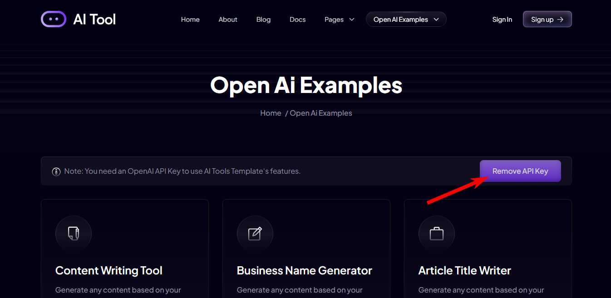

## Getting Started with Open AI API

### For Demo

For testing the demo you have to add the api-key.

- Got to /ai-examples
- Click on the **Set API Key** button


And save it.

Once you are done testing you can remove the key from here:



### For Developement

For developement you have to save the Api-Key on the .env file with the follwing name

```
OPENAI_API_KEY=YOUR_API_KEY
```

### How to change the model?

By default we are using the `gpt-3.5-turbo` model.
If you want to use other model you can do that too.

To change the model, open up the template in your code editor.
Then go to the route.ts file under **ai-examples** and add your prefered model

Note: You can find all the model from here: https://platform.openai.com/docs/models/overview


## Installation and Configuration

You must follow the documentation setp by step in this order to do a successful installation and configuration.

### [AI Tool Installation and Config Docs](https://nextjstemplates.com/docs/templates#ai-tool)

---

### Deploying on PaaS

If you are using a GitHub repo then you can go with free-of-cost and easy-to-use options like [Vercel](https://vercel.com/), or [Netlify](https://netlify.com/) they offer decent-free tiers for Next.js hosting.

#### If you are using Prisma ORM (Comes with All Starter Templates)

Make sure to edit build command like this while you use Prisma as ORM while deploying to Vercel.


### Update Logs

**February 2024:**

- Updated Stripe Integraion: Loading pricing data from pricingData file

**March 2024:**

- Upgraded to next 14
- Fixed auth issues
- Updated all the packages
- Update ts config & fix all the issues
- Update signin & signup page design
- Integrated Magic link signin &
- Forgot password
- Added loader on buttons# VCEL

# VCEL
